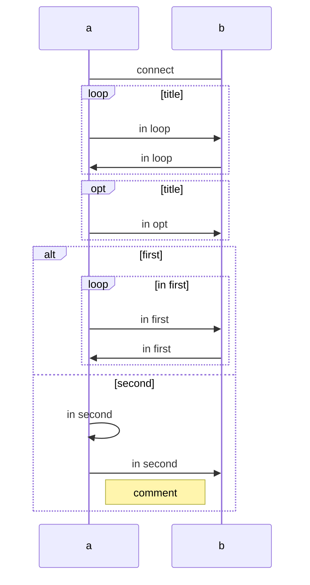

```mermaid
sequenceDiagram
  participant a
  participant b

  a->b: connect

  loop title
    a->>b: in loop
    b->>a: in loop
  end

  opt title
    a->>b: in opt
  end

  alt first
    loop in first
      a->>b: in first
      b->>a: in first
    end
  else second
    a->>a: in second
    a->>b: in second
    Note right of a: comment
  end
```
